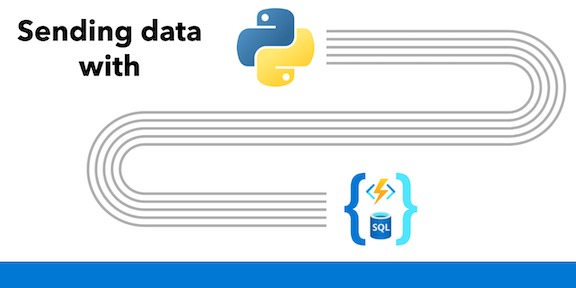

# Sample: Load data from SQL using Python and Azure Functions

**How do I transfer data from Azure SQL Database in Python every day?**

* [Scenario 1](#scenario-1-write-to-an-ftp-server): Generate .txt files from data currently stored in Azure SQL Database and send the files to an FTP server
* [Scenario 2](#scenario-2-send-data-to-an-api-endpoint): Take data from the Azure SQL Database and send the data to an API endpoint



## Contents

|File/folder| Description|
|:--|:--|
|`SendDataToAPI`| Azure Function that sends data from SQL to an API endpoint, [Scenario 2](#scenario-2-send-data-to-an-api-endpoint)|
|`SendDataToFTP`| Azure Function that sends data from SQL to an FTP server, [Scenario 1](#scenario-1-write-to-an-ftp-server)|
|`local.settings.json.sample`| Azure Functions app settings file, used for local development - update and copy to `local.settings.json`|
|`host.json`| Azure Functions host settings file|
|`README.md`| This README file|
|`requirements.txt`| Python dependencies for the Azure Function, including `azure-functions`, `pandas`, and `requests`|

## Prerequisites to local development

1. Complete the [Configure your environment](https://learn.microsoft.com/en-us/azure/azure-functions/create-first-function-vs-code-python?pivots=python-mode-configuration#configure-your-environment) steps to setup your local development environment for Azure Functions.
2. If you don't have a SQL database, either run [SQL Server in a container](https://learn.microsoft.com/sql/linux/quickstart-install-connect-docker) or create an [Azure SQL Database](https://learn.microsoft.com/azure/azure-sql/database/single-database-create-quickstart).

## Setup

1. Clone this repository to your local machine.
2. Open the folder in Visual Studio Code.
3. Copy `local.settings.json.sample` to `local.settings.json` and update the values for `SqlConnectionString`, `FTP_HOST`, `FTP_USER`, and `FTP_PASS` with your own values.

## Running the sample

1. Start the function locally by pressing `F5` in Visual Studio Code or the `Run and Debug` icon in the left-hand side Activity bar.
2. Manually invoke the timer triggers using the [built-in HTTP endpoint](https://learn.microsoft.com/azure/azure-functions/functions-bindings-timer?tabs=python-v2%2Cin-process&pivots=programming-language-csharp#manually-invoke-a-timer-trigger).

## Scenario 1: write to an FTP server

To write data to an FTP server, we can use the built-in library `ftplib` in Python.

- More about ftplib: https://docs.python.org/3/library/ftplib.html
- More about pandas to_csv: https://pandas.pydata.org/docs/reference/api/pandas.DataFrame.to_csv.html
- Test FTP server: https://dlptest.com/ftp-test/
- Sample function code: [SendDataToFTP](SendDataToFTP)

```python
def main(everyDayAt5AM: func.TimerRequest, products: func.SqlRowList) -> func.HttpResponse:
    logging.info('Python HTTP trigger function processed a request.')
    filename = "products.txt"
    filesize = 0

    # convert the SQL data to comma separated text
    product_list = pandas.DataFrame(products)
    product_csv = product_list.to_csv(index=False)
    datatosend = io.BytesIO(product_csv.encode('utf-8'))

    # get FTP connection details from app settings
    FTP_HOST = os.environ['FTP_HOST']
    FTP_USER = os.environ['FTP_USER']
    FTP_PASS = os.environ['FTP_PASS']

    # connect to the FTP server
    try:
        with ftplib.FTP(FTP_HOST, FTP_USER, FTP_PASS, encoding="utf-8") as ftp:
            logging.info(ftp.getwelcome())
            # use FTP's STOR command to upload the data
            ftp.storbinary(f"STOR {filename}", datatosend)
            filesize = ftp.size(filename)
            ftp.quit()
    except Exception as e:
        logging.error(e)

    logging.info(f"File {filename} uploaded to FTP server. Size: {filesize} bytes")
```

## Scenario 2: send data to an API endpoint

To send the data from the SQL input binding to an API endpoint from the Azure Function, we can import the `requests` library and use it to make a POST request to the API endpoint.

- More about requests: https://requests.readthedocs.io/en/latest/user/quickstart/
- Sample function code: [SendDataToAPI](SendDataToAPI)

```python
def main(everyDayAt5AM: func.TimerRequest, products: func.SqlRowList) -> None:
    logging.info('Python timer trigger function started')
    # convert the SQL data to JSON in memory
    rows = list(map(lambda r: json.loads(r.to_json()), products))

    # get the API endpoint from app settings
    api_url = os.environ['API_URL']

    # send the data to the API
    response = requests.post(api_url, json=rows)
    # check for 2xx status code
    if response.status_code // 100 != 2:
        logging.error(f"API response: {response.status_code} {response.reason}")
    else:
        logging.info(f"API response: {response.status_code} {response.reason}")
```

## Key concepts

### Get data from Azure SQL Database in Azure Functions

With [Azure SQL bindings for Azure Functions](https://aka.ms/sqlbindings), we can easily retrieve data from an Azure SQL Database in an Azure Function.

We retrieve data from SQL using an **input binding** for Azure Functions by adding the following to the `function.json` file:

```json
{
    "name": "products",
    "type": "sql",
    "direction": "in",
    "commandText": "SELECT [ProductID],[Name],[ProductModel],[Description] FROM [SalesLT].[vProductAndDescription]",
    "commandType": "Text",
    "connectionStringSetting": "SqlConnectionString"
}
```

In this input binding, we are specifying a **query** to run against the database in the `commandText` property. We also specify the `connectionStringSetting` which is the name of the connection string in the `local.settings.json` file and Azure Functions app settings.

The output of that query is passed to the Azure Function as the parameter `products`, specified by the json property `name`.

### Azure Functions timer trigger

For tasks that need to run on a schedule, we can use the [timer trigger](https://learn.microsoft.com/azure/azure-functions/functions-bindings-timer?tabs=in-process&pivots=programming-language-python) for Azure Functions.

A few notes:
- The timer trigger assumes UTC time, and the `WEBSITE_TIME_ZONE` app setting is available only for certain hosts.
- Timer triggers use NCRONTAB expressions to set the schedule, which is similar to CRON but with an additional field for seconds (`{second} {minute} {hour} {day} {month} {day-of-week}`).

```json
{
    "name": "everyDayAt5AM",
    "type": "timerTrigger",
    "direction": "in",
    "schedule": "0 0 5 * * *"
}
```